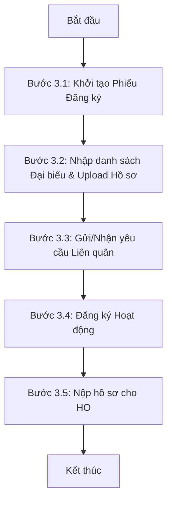
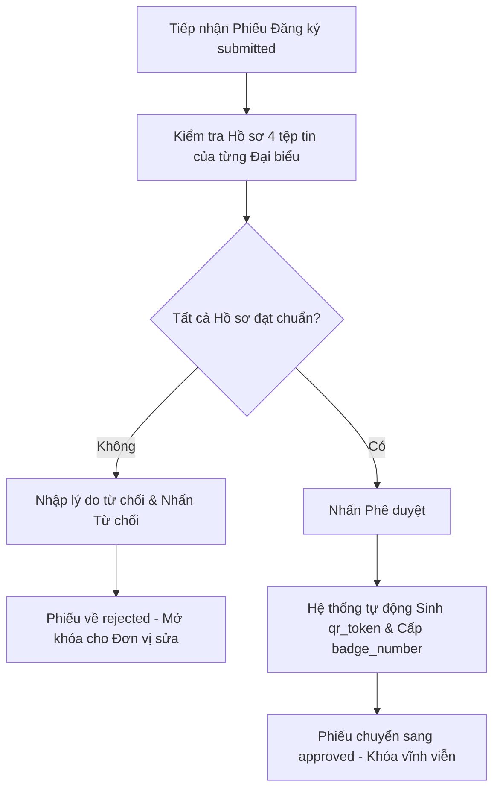

# HƯỚNG DẪN SỬ DỤNG HỆ THỐNG EVENTREGIS
## PHÂN HỆ: QUY TRÌNH ĐĂNG NHẬP & ĐĂNG KÝ SỰ KIỆN
**Hệ Thống Quản Lý Sự Kiện Đại Hội Tập Trung**  
*Phiên bản: 2.0 (Cập nhật 2026)*

---

## 1. Tổng Quan & Phân Quyền Vai Trò (Actors)

Hệ thống **EventRegis** được xây dựng nhằm số hóa và tự động hóa toàn bộ quy trình tổ chức sự kiện đại hội tập trung với quy mô ~600 đại biểu từ 50-100 đơn vị thành viên. Để đảm bảo tính đồng bộ dữ liệu, kiểm soát gian lận và tối ưu hóa thời gian xử lý, quy trình đăng nhập và đăng ký sự kiện được kiểm soát chặt chẽ thông qua các vai trò (Actors) sau:

*   **Đại diện Đơn vị (Unit Representative):** Sử dụng tài khoản đơn vị liên kết SSO Portal để tạo phiếu đăng ký, thiết lập liên quân, đồng bộ/nhập thông tin đại biểu, tải lên hồ sơ pháp lý bắt buộc, đăng ký các hoạt động thể thao/nghiệp vụ và nộp hồ sơ phê duyệt.
*   **Nhân sự HO (HR HO):** Kiểm tra tính hợp lệ của hồ sơ đại biểu (CCCD, ảnh chân dung, Hợp đồng lao động), đưa ra quyết định Phê duyệt (Approve) hoặc Từ chối (Reject) toàn bộ phiếu đăng ký kèm lý do lỗi cụ thể, gán vai trò đại biểu và chỉ định Trưởng đoàn.
*   **Admin HO:** Toàn quyền cấu hình đợt đăng ký, thiết lập số môn thể thao tối đa cho đại biểu, và quản lý in thẻ đại biểu hàng loạt.

---

## 2. Quy Trình Đăng Nhập Hệ Thống (System Authentication & SSO Portal)

Hệ thống EventRegis sử dụng giải pháp đăng nhập đơn nhất **Single Sign-On (SSO)** thông qua hệ thống **Portal Mường Thanh** nhằm tối ưu bảo mật và đồng nhất thông tin tài khoản nhân viên.

### 2.1 Cơ chế Hoạt động của SSO Portal
1.  **Chuyển hướng (Redirect):** Khi người dùng truy cập trang chủ `http://event.mt:8080/`, hệ thống kiểm tra session. Nếu chưa đăng nhập, hệ thống sẽ tự động chuyển hướng sang trang đăng nhập của Portal:
    `https://portal.muongthanh.vn/login?redirect=http://event.mt:8080/`
2.  **Xác thực và Cấp Token:** Sau khi người dùng đăng nhập thành công trên Portal, Portal sẽ chuyển hướng ngược lại EventRegis kèm theo một mã token JWT an toàn trong URL:
    `http://event.mt:8080/?sso_token=xxx`
3.  **Xử lý Callback & Lưu Session:** Controller `SiteController::actionIndex()` tiếp nhận `sso_token`, giải mã chữ ký JWT bằng thuật toán **HS256** và mã khóa bí mật `JWT_SECRET`. Khi token hợp lệ, hệ thống sẽ gọi API `/api/sso/me` để lấy thông tin chi tiết nhân viên (Mã đơn vị, Phòng ban, Chức vụ) và lưu trữ vào Session của Yii.

### 2.2 Quy trình Đăng nhập Thực tế (Khi tài khoản đã đăng nhập sẵn trên Chrome)
Trong trường hợp tài khoản của bạn đã được đăng nhập sẵn trên trình duyệt Chrome, hệ thống hỗ trợ đăng nhập nhanh thông qua 2 phương thức cực kỳ tiện lợi:

#### Phương thức 1: Đăng nhập từ trang chủ Portal (Portal Dashboard)
1.  **Mở Portal:** Người dùng mở trình duyệt Chrome đã lưu session và truy cập trang chủ Portal: `https://portal.muongthanh.vn`
2.  **Click chọn Ứng dụng:** Tại giao diện màn hình chính của Portal (nơi hiển thị các phân hệ/ứng dụng được phân quyền), tìm và click vào biểu tượng ứng dụng **"Đăng ký Sự kiện"** (hoặc **"Event Regis"**).
3.  **Tự động chuyển hướng:** Hệ thống Portal nhận diện phiên hoạt động, tự động sinh mã Token JWT an toàn và thực hiện chuyển hướng trình duyệt thẳng tới hệ thống EventRegis kèm tham số mã hóa:
    `http://event.mt:8080/?sso_token=<JWT_TOKEN_CỦA_BẠN>`
4.  **Vào thẳng Dashboard:** Hệ thống EventRegis tự động xử lý token callback và đưa bạn trực tiếp vào giao diện làm việc chính (`http://event.mt:8080/admin/default/index`) trong chưa đầy 1 giây mà không cần nhập lại bất kỳ thông tin nào.

#### Phương thức 2: Đăng nhập từ trang chủ EventRegis (Silent Login)
1.  **Mở EventRegis:** Người dùng nhập trực tiếp địa chỉ trang đăng ký sự kiện trên thanh địa chỉ Chrome: `http://event.mt:8080/`
2.  **Click nút Đăng nhập:** Hệ thống hiển thị trang đăng nhập (Hình 1), người dùng click vào nút màu tím **"Đăng nhập với Portal"**.
3.  **Nhận diện phiên tự động:** Trình duyệt chuyển hướng nhanh sang Portal (`https://portal.muongthanh.vn/login?redirect=...`). Do Chrome đã lưu sẵn phiên đăng nhập Portal của bạn, hệ thống Portal sẽ nhận diện và xác thực tự động ngay lập tức mà không hiển thị màn hình điền Tên đăng nhập & Mật khẩu.
4.  **Hoàn tất xác thực:** Portal tự động điều hướng ngược trở lại EventRegis kèm theo mã `sso_token`, hệ thống thiết lập session và cho phép bạn bắt đầu làm việc ngay lập tức.

### 2.2 Quản lý Phiên Đăng nhập (Session Lifecycle)
*   **Thời gian hết hạn (Session Timeout):** Phiên làm việc được cấu hình mặc định là **1800 giây (30 phút)** không có hoạt động.
*   **Thời gian làm mới (Refresh Interval):** Mỗi **900 giây (15 phút)**, hệ thống sẽ tự động làm mới token ngầm để duy trì đăng nhập mà không làm gián đoạn trải nghiệm của người dùng.
*   **Đăng xuất (Logout):** Khi người dùng click Đăng xuất, `SiteController::actionLogout()` sẽ hủy toàn bộ session lưu trên server và localStorage trên trình duyệt, sau đó điều hướng người dùng quay trở lại trang đăng nhập.

*Hình 1: Giao diện Trang đăng nhập tích hợp Portal SSO khi chạy thực tế tại đường dẫn http://event.mt:8080/*

---

## 3. Quy Trình Đăng Ký Sự Kiện (Event Registration Workflow)

Quy trình đăng ký sự kiện là luồng nghiệp vụ khép kín gồm 5 bước tuần tự bắt buộc:

### Bước 3.1: Khởi tạo Phiếu Đăng Ký (Create Registration Ticket)
*   Đại diện đơn vị đăng nhập vào hệ thống trong khung thời gian đăng ký được mở (`registration_periods`).
*   Truy cập menu **Đăng ký Sự kiện** và click **Khởi tạo Phiếu Đăng ký**. Hệ thống tự động tạo một phiếu đăng ký với trạng thái mặc định ban đầu là `draft` (Bản nháp) gắn với đơn vị của tài khoản đó.
*   *Lưu ý:* Mỗi đơn vị chỉ được phép có đúng một phiếu đăng ký hoạt động trong mỗi đợt đăng ký (`uq_registrations_org_period`).

### Bước 3.2: Nhập Danh sách Đại Biểu & Tải lên Hồ sơ Bắt buộc
Đại diện đơn vị vào trang chi tiết phiếu đăng ký, chọn tab **Danh sách Đại biểu** -> Click **Thêm đại biểu** để nhập nhân sự tham gia đại hội.

#### A. Nguồn dữ liệu nhân sự (BR-REG-01)
Hệ thống hỗ trợ 2 cơ chế nhập liệu linh hoạt:
1.  **Đồng bộ từ Hệ thống SMILE (Khuyên dùng):** Người dùng nhập tên hoặc mã nhân viên để tìm kiếm. Hệ thống tự động truy vấn dữ liệu SMILE và điền các trường thông tin: Họ tên, Chức vụ hiện tại, Mã phòng ban.
    *   **RÀNG BUỘC NGHIỆP VỤ BẮT BUỘC:** Để đảm bảo tính công bằng, hệ thống tự động lọc và **chỉ cho phép đăng ký những nhân sự có ngày gia nhập đơn vị trước ngày 01/06/2026**. Những nhân viên gia nhập từ ngày 01/06/2026 trở đi sẽ bị hệ thống tự động ẩn hoặc chặn không cho đăng ký.
2.  **Nhập thủ công (Manual CRUD):** Đối với nhân viên chính thức thỏa mãn điều kiện thời gian gia nhập nhưng chưa được cập nhật dữ liệu trên hệ thống SMILE, đại diện đơn vị tích chọn ô **Tự nhập thông tin** để điền thủ công.

#### B. Validate Tài liệu Đính kèm Bắt buộc (BR-REG-02 & BR-REG-03)
Với mỗi đại biểu được tạo, đơn vị bắt buộc phải tải lên đầy đủ **4 tệp tin hồ sơ pháp lý** sau:
*   **Ảnh mặt trước CCCD:** Định dạng ảnh JPG/PNG, dung lượng tối đa 5MB.
*   **Ảnh mặt sau CCCD:** Định dạng ảnh JPG/PNG, dung lượng tối đa 5MB.
*   **Ảnh chân dung in thẻ (Portrait):** Bắt buộc phải có **kích thước chính xác 530x530 pixel**. Hệ thống kiểm tra kích thước ảnh ở phía server. Nếu ảnh không đúng 530x530px, hệ thống sẽ báo lỗi validation và từ chối lưu hồ sơ.
*   **Scan Hợp đồng lao động (Labor Contract):** File scan PDF hoặc ảnh JPG rõ chữ ký/dấu đỏ chứng minh đại biểu là nhân viên chính thức của đơn vị, dung lượng tối đa 10MB.

### Bước 3.3: Thiết lập Liên quân theo từng Nội dung (Content-level Alliance)
Cơ chế **Liên quân theo nội dung** cho phép các đơn vị nhỏ ghép nhân sự để thành lập đội thi đấu thể thao tập thể hoặc tiết mục văn nghệ chung. Liên quân hoạt động độc lập theo từng nội dung cụ thể, không áp dụng chung cho toàn bộ sự kiện.

*   **Gửi yêu cầu liên quân (BR-AL05):** Đại diện đơn vị truy cập tab **Liên quân** -> Chọn nút **Gửi yêu cầu** -> Chọn đơn vị đối tác, chọn nội dung muốn liên quân (Ví dụ: *Bóng đá nam*) và click **Gửi**. Trạng thái yêu cầu sẽ ở dạng `pending` (Chờ duyệt).
*   **Duyệt yêu cầu liên quân (BR-AL06):** Đơn vị đối tác sau khi đăng nhập sẽ thấy yêu cầu chờ duyệt. Đại diện đơn vị đối tác có quyền click **Đồng ý** (Trạng thái chuyển sang `approved` - kích hoạt liên quân thành công) hoặc **Từ chối** (Trạng thái `rejected` kèm lý do).
*   **Ràng buộc số lượng (BR-AL02 & BR-AL03):** Một đơn vị chỉ được phép liên quân tối đa với số lượng đơn vị khác được cấu hình cho mỗi nội dung (`max_alliance_orgs`).

### Bước 3.4: Đăng ký Hoạt động Chi tiết (Event Registration)
Đại diện đơn vị vào phần **Đăng ký hoạt động** để đăng ký các môn thi đấu và nội dung đại hội:
*   **Đăng ký theo số lượng (Quantity-based):** Áp dụng cho các môn thể thao tập thể (Ví dụ: Bóng đá, Kéo co). Đơn vị chỉ đăng ký tham gia và số lượng đội thi đấu. Bước này chưa cần điền chi tiết danh sách vận động viên.
*   **Đăng ký theo danh sách cụ thể (Detailed-based):** Áp dụng cho cuộc thi sắc đẹp, thi văn nghệ cá nhân và thi nghiệp vụ. Đơn vị bắt buộc phải chọn trực tiếp đại biểu cụ thể trong danh sách đại biểu đã tạo ở Bước 3.2 để gán vào nội dung thi đấu.
    *   **Validate môn thể thao tối đa (BR-REG-05):** Mỗi đại biểu chỉ được đăng ký tham gia tối đa **N môn thể thao root** (Cấu hình bởi tham số `max_sports_per_attendee`, mặc định là 3).
    *   **Validate phòng ban thi nghiệp vụ (BR-REG-06):** Đối với các cuộc thi nghiệp vụ (Ví dụ: Thi Lễ tân xuất sắc), đại biểu đăng ký bắt buộc phải có mã phòng ban thuộc SMILE nằm trong danh mục phòng ban được phép thi (`competition_departments`). Hệ thống tự động từ chối nếu gán nhân sự sai phòng ban chuyên môn.

### Bước 3.5: Nộp Hồ Sơ Đăng Ký (Submit Registration)
*   Sau khi hoàn thiện danh sách đại biểu, liên quân và nội dung đăng ký, Đại diện đơn vị nhấn nút **Nộp đăng ký**.
*   Phiếu đăng ký sẽ chuyển trạng thái từ `draft` sang `submitted` (Đã nộp).
*   **HÀNH VI HỆ THỐNG:** Khi phiếu ở trạng thái `submitted`, hệ thống sẽ **khóa toàn bộ quyền chỉnh sửa** (Read-only) của đơn vị đối với danh sách đại biểu và các nội dung đã đăng ký để đảm bảo tính toàn vẹn dữ liệu trong quá trình phê duyệt.

*Hình 2: Giao diện Danh sách Phiếu đăng ký của các đơn vị khi chạy thực tế tại đường dẫn http://event.mt:8080/admin/registrations/admin*

---

## 4. Quy Trình Kiểm Duyệt Hồ Sơ & Phê Duyệt (Approval Workflow)

Nhân sự HO (HR HO) thực hiện quy trình kiểm tra và phê duyệt phiếu đăng ký của các đơn vị trên trang Admin.

### 4.1 Tiếp nhận & Thẩm định Hồ sơ Đại biểu
*   HR HO truy cập trang **Kiểm duyệt Đăng ký**, mở chi tiết phiếu của đơn vị đang có trạng thái `submitted`.
*   Click xem chi tiết từng đại biểu trong danh sách:
    *   Preview hình ảnh chân dung in thẻ (Đảm bảo sắc nét, phông nền sáng, đúng kích thước).
    *   Kiểm tra ảnh chụp 2 mặt CCCD và nội dung tệp scan Hợp đồng lao động để xác minh danh tính và tính hợp lệ pháp lý của đại biểu (đảm bảo đúng là nhân viên chính thức của đơn vị đó).

### 4.2 Đưa ra Quyết định Phê duyệt (Approve / Reject)
*   **Từ chối Phiếu đăng ký (Reject):**
    *   Nếu phát hiện bất kỳ hồ sơ đại biểu nào bị lỗi (Ví dụ: Ảnh chân dung mờ/không đúng chuẩn, hợp đồng lao động sai tên, gia nhập đơn vị sau ngày 01/06/2026...), HR HO click nút **Từ chối**.
    *   **Bắt buộc** phải nhập lý do từ chối chi tiết trong hộp thoại hiện ra.
    *   Phiếu đăng ký chuyển sang trạng thái `rejected`. Hệ thống tự động mở khóa quyền chỉnh sửa cho đơn vị để cập nhật lại hồ sơ lỗi và nộp lại từ đầu.
*   **Phê duyệt Phiếu đăng ký (Approve):**
    *   Nếu toàn bộ danh sách đại biểu và hồ sơ đính kèm đạt yêu cầu, HR HO click nút **Phê duyệt**.
    *   Phiếu đăng ký chuyển sang trạng thái `approved`.
    *   **TÁC VỤ TỰ ĐỘNG CỦA HỆ THỐNG KHI PHÊ DUYỆT:** Hệ thống tự động thực hiện 2 thao tác ngầm cực kỳ quan trọng cho tất cả đại biểu trong phiếu:
        1.  **Sinh mã QR duy nhất (`qr_token`):** Tạo một chuỗi token ngẫu nhiên dài 64 ký tự gán cho thuộc tính `qr_token` của đại biểu (dùng để quét camera tra cứu thông tin di động, không lộ ID hệ thống).
        2.  **Cấp số thứ tự thẻ (`badge_number`):** Tự động sinh số thứ tự in thẻ tăng dần theo sequence (Ví dụ: `001`, `002`, `003`...) để chuẩn bị cho công tác in thẻ vật lý hàng loạt.

*Hình 3: Giao diện Chi tiết Phiếu đăng ký hiển thị danh sách đại biểu, hồ sơ đính kèm và nút Phê duyệt của HR HO*

---

## 5. Tổng Hợp Các Ràng Buộc Nghiệp Vụ (Business Rules Summary)

| Mã Ràng Buộc | Nội Dung Ràng Buộc | Cơ Chế Kiểm Soát (Validation) |
| :--- | :--- | :--- |
| **BR-REG-01** | Nhập danh sách đại biểu | Cho phép chọn từ SMILE hoặc tự nhập nếu chưa có trên SMILE. |
| **BR-REG-02** | Hồ sơ đính kèm bắt buộc | Bắt buộc tải lên đủ 4 file: CCCD Mặt trước, CCCD Mặt sau, Ảnh chân dung, Scan HĐLĐ. |
| **BR-REG-03** | Kích thước ảnh chân dung | Validate phía máy chủ: Kích thước ảnh chân dung bắt buộc phải đúng **530x530 pixel**. |
| **BR-REG-04** | Thời gian gia nhập của nhân viên | Tự động ẩn hoặc chặn đăng ký với nhân viên gia nhập đơn vị từ ngày **01/06/2026** trở đi. |
| **BR-REG-05** | Giới hạn môn thể thao của đại biểu | Mỗi đại biểu đăng ký tối đa **N môn thể thao root** (Mặc định `max_sports_per_attendee = 3`). |
| **BR-REG-06** | Phòng ban thi nghiệp vụ | Đại biểu thi nghiệp vụ phải có mã phòng ban SMILE khớp với cấu hình `competition_departments`. |
| **BR-AL01** | Điều kiện liên quân nội dung | Chỉ áp dụng liên quân cho các môn thể thao tập thể có cấu hình cho phép liên quân. |
| **BR-AL03** | Giới hạn số đơn vị liên quân | Số lượng đơn vị ghép đội liên quân không được vượt quá `max_alliance_orgs` cấu hình cho nội dung đó. |
| **BR-APPROVE**| Đồng bộ trạng thái phê duyệt | Phê duyệt hoặc từ chối thực hiện trên **toàn bộ phiếu đăng ký** của đơn vị, không phê duyệt riêng lẻ từng đại biểu. |
