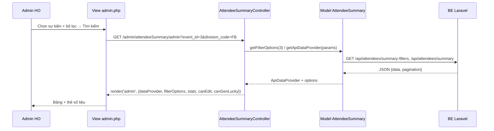
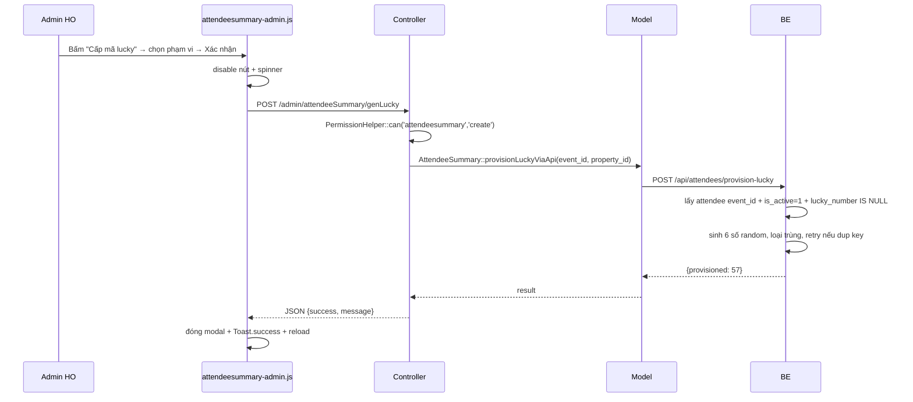

# Tổng hợp danh sách người tham dự & cấp mã Lucky

> Tài liệu phân tích nghiệp vụ (PRD) — màn hình tổng hợp toàn bộ người tham dự của tất cả đơn vị,
> lọc theo đơn vị / bộ phận / phòng ban, cấp mã lucky draw duy nhất, sửa thủ công chức danh.
> Cập nhật: 2026-10-03. Liên quan: `docs/chung-ket-fun-run.md`, `docs/system-design.md`.

---

## 1. Mục tiêu & phạm vi

### Mục tiêu
Sau khi tất cả đơn vị đã nộp/được duyệt đăng ký, HO cần **một màn hình duy nhất** nhìn thấy
**toàn bộ người tham dự của toàn bộ đơn vị** trong một sự kiện, để:

1. Tra cứu / lọc nhanh theo **đơn vị (property)**, **bộ phận (division)**, **phòng ban (department)**.
2. **Cấp mã lucky draw** duy nhất cho từng người — mã này đồng thời là **mã đăng nhập**
   (`DHMT` + lucky) và là gốc để ghép **số BIB** của cổng chạy (xem `chung-ket-fun-run.md` §3).
3. **Sửa thủ công chức danh hiển thị** của từng người, độc lập với chức danh đồng bộ từ SMILE
   (để in thẻ / xuất danh sách / bốc thăm đúng chức danh mong muốn).
4. Xuất Excel danh sách tổng hợp (kèm mã lucky) để phân phát định danh và phục vụ bốc thăm.

### Trong phạm vi
- Màn hình admin tổng hợp: bộ lọc + bảng phân trang + tìm kiếm.
- Cấp mã lucky theo sự kiện (idempotent) và cấp bù cho người thêm sau.
- Sửa chức danh hiển thị (inline edit + modal sửa 1 người), có ghi `updated_by`.
- Xuất Excel theo bộ lọc hiện tại.
- Phân quyền theo controller mới.

### Ngoài phạm vi (giai đoạn này)
- Cơ chế **bốc thăm** (random, giải thưởng, màn hình trình diễn quay số) — tài liệu riêng.
- Gửi mã lucky/PIN tự động qua email/SMS/Zalo.
- Đặt/khởi tạo lại `login_pin` thay người dùng (reset PIN) — nêu ở §13 câu hỏi.
- In thẻ / QR (đã có module badge riêng).
- Sửa các field khác ngoài chức danh (họ tên, đơn vị… vẫn sửa ở màn đăng ký/duyệt).

---

## 2. Người dùng & quyền

| Actor | Quyền trên màn hình này |
|-------|------------------------|
| **Admin HO** (`users.role=admin`, hoặc permission `*`) | Toàn quyền: xem, lọc, cấp mã lucky, sửa chức danh, xuất Excel |
| **Nhân sự HO (HR)** | Xem + lọc + xuất Excel; sửa chức danh nếu được cấp `update` |
| **BTC các ban** | Chỉ xem (read) nếu được cấp — phục vụ tra cứu |
| **Đại diện đơn vị** | **Không** truy cập (màn hình này là toàn hệ thống) |

### Permission mới
- Controller mới: **`attendeesummary`** (đặt theo quy ước key chữ thường của `MControllers`).
- Mapping action → quyền:

| Action | Quyền yêu cầu |
|--------|---------------|
| `admin` (danh sách), `export` | `attendeesummary.read` |
| `updatePosition` (sửa chức danh) | `attendeesummary.update` |
| `genLucky` (cấp mã lucky) | `attendeesummary.create` |

- Check bằng `PermissionHelper::can('attendeesummary', 'update')` trong controller **và** ẩn/hiện
  nút trong view.
- Việc cấu hình: thêm bản ghi vào bảng `MControllers` + cột `roles.controllers` để hiện menu sidebar.

---

## 3. Quyết định thiết kế then chốt: VIEW/query trực tiếp hay bảng snapshot?

### Hiện trạng (đã kiểm chứng trong code)
- `attendees` **đã có** đầy đủ dữ liệu cần thiết: `event_id`, `registration_id`, `property_id`,
  `staff_id`, `staff_code`, `full_name`, `id_card`, `position`, `position_code`, `position_name`,
  `department_code`, `department_name`, `unit_label`, `attendee_type`, `is_active`,
  `approval_status`, `qr_token`, `badge_number`
  (migration `database/migrations/2026_06_16_084548_add_columns_to_attendees_table.php`).
- `attendees` **đã có** `lucky_number` (UNIQUE), `login_pin`, `pin_set_at`,
  `login_failed_attempts`, `login_locked_until`
  (migration `Modules/Run/Database/Migrations/2026_10_02_100002_add_run_login_columns_to_attendees_table.php`).
- Quy mô: ~600 → vài nghìn bản ghi/sự kiện. Đây là **quy mô nhỏ** với MySQL/InnoDB.

### Trade-off

| Tiêu chí | Query trực tiếp trên `attendees` | Bảng snapshot riêng |
|----------|----------------------------------|---------------------|
| Đồng bộ dữ liệu | ✅ Luôn đúng realtime; người thay thế/huỷ/bổ sung phản ánh ngay | ❌ Lệch ngay khi có thay/huỷ/bổ sung; phải có job/nút "làm mới" + xử lý diff |
| Sửa chức danh thủ công | ✅ Lưu vào cột override trên `attendees`, đi theo người suốt vòng đời (in thẻ, email, cổng chạy đều hưởng) | ⚠️ Chỉ sống trong snapshot; các màn khác (thẻ, email) vẫn dùng chức danh cũ → **hai nguồn sự thật** |
| Mã lucky | ✅ `lucky_number` đã nằm trên `attendees` và UNIQUE; cổng chạy `RunAuthService::resolve` tra thẳng cột này | ❌ Nếu để lucky ở snapshot thì cổng chạy phải sửa để join snapshot — đập vào code đã verified |
| Hiệu năng | ✅ ~600–5.000 dòng, lọc theo index `event_id`/`property_id`, phân trang 25–50 → vài ms | Không nhanh hơn đáng kể ở quy mô này |
| Rủi ro mới | Cần bổ sung filter + index (nhỏ) | Thêm bảng, thêm job, thêm trạng thái lệch, thêm bug |
| Người nộp muộn | ✅ Tự xuất hiện | ❌ Phải chạy lại snapshot |

### ✅ KHUYẾN NGHỊ (chốt)
**KHÔNG tạo bảng snapshot.** Dùng **query tổng hợp trực tiếp trên `attendees`** qua một
endpoint/repository mới (`attendees/summary`), cộng thêm:

1. Bổ sung **cột override chức danh** trên `attendees` (§5).
2. Bổ sung **cột bộ phận** trên `attendees` để lọc không cần join (§4).
3. Bổ sung **index** phục vụ lọc (§7).
4. Mã lucky giữ nguyên trên `attendees.lucky_number` (đã có, đã UNIQUE).

Lý do quyết định: màn hình này là **khung nhìn (view) + nơi chỉnh sửa một vài field**, không phải
"chốt sổ bất biến". Dữ liệu người tham dự còn biến động liên tục (thay thế / huỷ tư cách / bổ sung
người — xem `replace-withdraw-attendee`), nên snapshot chắc chắn lệch. Nếu sau này cần **chốt sổ
bất biến để bốc thăm** (danh sách đóng băng tại thời điểm T), hãy làm **snapshot chỉ-đọc riêng cho
phiên bốc thăm** (bảng `lucky_draw_snapshots`) ở tài liệu bốc thăm — đó là nhu cầu khác, không
phải màn hình này.

---

## 4. Nguồn dữ liệu "đơn vị / bộ phận / phòng ban"

### Cây tổ chức thực tế trong BE (đã kiểm chứng)
```
properties (đơn vị / khách sạn)   ← attendees.property_id
   └── divisions (BỘ PHẬN)        ← divisions: property_code, code, name, unique_code
         └── departments (PHÒNG BAN) ← departments: property_code, division_code, code, name
               └── staffs         ← staffs: property_code, division_code, department_code, position_code
```

### Trên `attendees` hiện có gì

| Khái niệm | Cột trên `attendees` | Trạng thái |
|-----------|---------------------|-----------|
| Đơn vị | `property_id` (+ `unit_label` là **nhãn in thẻ**, không phải mã đơn vị) | ✅ Có |
| Phòng ban | `department_code`, `department_name` | ✅ Có (set trong `AttendeeService::syncWithStaffData` khi có `staff_id`) |
| Bộ phận | **KHÔNG CÓ** | ❌ Thiếu |
| Chức danh SMILE | `position_code`, `position_name` | ✅ Có |

> Lưu ý: `Modules/Registration/Http/Resources/AttendeeResource.php` **đã trả** `division_code`/
> `division_name` nhưng bằng fallback `$this->staff->division_code` / `$this->staff->division->name`
> — tức **chỉ có khi `staff_id` tồn tại**, và **không lọc/sort được** vì không có cột trên bảng.
> Người nhập thủ công (không từ SMILE) sẽ rỗng.

### Phải bổ sung
- Thêm 2 cột trên `attendees`: **`division_code`**, **`division_name`** (nullable, string 255).
- Điền giá trị tại `AttendeeService::syncWithStaffData` (lấy `$staff->division_code` và
  `$staff->division->name`).
- Viết **command backfill** cho dữ liệu cũ: với attendee có `staff_id` → lấy từ `staffs`;
  với attendee chỉ có `department_code` → tra `departments.division_code` theo
  (`property_code`, `code`) rồi lấy tên từ `divisions`.
- Attendee nhập thủ công (không có `staff_id`, không `department_code`): để rỗng, màn hình gom vào
  nhóm **"Chưa xác định"** và có bộ lọc riêng để HO rà soát.

---

## 5. Chức danh: gốc (SMILE) vs hiển thị (override)

### Phân tích hiện trạng
Trên `attendees` đang có **ba** field liên quan:
- `position_code`, `position_name` — **đồng bộ từ SMILE**, bị ghi đè mỗi lần `syncWithStaffData`.
- `position` — field người dùng nhập ở form đăng ký (và là field duy nhất mà whitelist finalist VCK
  cho sửa). Nhưng `position` đang bị dùng **lẫn lộn** làm cả "chức danh nhập tay" lẫn "chức danh
  in thẻ", nên không an toàn để làm override chính thức (nhiều luồng khác đang ghi vào nó).

### Thiết kế đề xuất (tách bạch 3 lớp)

| Lớp | Cột | Ai ghi | Ghi đè bởi sync SMILE? |
|-----|-----|--------|------------------------|
| Chức danh **gốc** | `position_code`, `position_name` | `syncWithStaffData` | ✅ Có (đúng kỳ vọng) |
| Chức danh **đơn vị nhập** | `position` | Form đăng ký của đơn vị | ❌ Không |
| Chức danh **hiển thị (override HO)** | **`position_override`** (mới) + `position_override_by`, `position_override_at` | **Chỉ** màn hình tổng hợp này | ❌ **Không bao giờ** |

### Quy tắc hiển thị (một hàm duy nhất, dùng chung mọi nơi)
```
chức danh hiển thị = position_override
                   ?: position
                   ?: position_name
                   ?: ''
```
- Đặt thành accessor trên Entity BE (`getDisplayPositionAttribute`) và trả về API dưới key
  **`position_display`** để FE (bảng tổng hợp, thẻ, Excel, email) dùng chung, không ai tự ghép lại.
- `syncWithStaffData` **không được** đụng `position_override`.
- UI phải hiển thị rõ: ô chức danh có icon ✎ khi đang là override, hover thấy chức danh gốc SMILE,
  và có nút **"Khôi phục chức danh gốc"** (set `position_override = NULL`).

---

## 6. Mã Lucky Draw

### Hiện trạng (đã kiểm chứng)
- `RunAuthService::provisionLucky(int $eventId)` sinh `random_int(100000, 999999)` → **6 chữ số**,
  kiểm tra trùng trong bộ nhớ dựa trên toàn bộ `lucky_number` đang dùng, **chỉ cấp cho người
  `lucky_number IS NULL`** → **đã idempotent** (chạy lại không đổi mã người đã có). ✅
- Command `run:gen-lucky {event_id}` + endpoint `POST /api/run-auth/gen-lucky` **đã tồn tại**,
  FE đã có nút ở `admin/runRegistrations/admin`. ✅
- **GIỚI HẠN QUAN TRỌNG:** `provisionLucky` chỉ quét attendee thuộc phiếu của
  `registration_periods.is_final = 1` (**chỉ finalist VCK**). Màn hình tổng hợp cần cấp mã cho
  **TOÀN BỘ người tham dự của sự kiện** → **phải mở rộng phạm vi**.
- `attendees.lucky_number` UNIQUE ở **cấp bảng** → unique **toàn hệ thống**, không theo event.
- `AttendeeResource` **chưa trả** `lucky_number` → phải bổ sung.

### Quyết định đề xuất
| Vấn đề | Quyết định đề xuất |
|--------|--------------------|
| Format | **6 chữ số**, `100000`–`999999` (giữ nguyên để không phá cổng chạy & BIB đã verified) |
| Unique scope | **Toàn hệ thống** (giữ UNIQUE hiện có). Lý do: mã là định danh đăng nhập, không được đụng nhau giữa các sự kiện; một người dự nhiều sự kiện nên **giữ nguyên một mã** |
| Idempotent | ✅ Chỉ cấp cho `lucky_number IS NULL`; **không bao giờ** sinh lại mã đã cấp |
| Người thêm sau | Bấm lại "Cấp mã lucky" → chỉ người chưa có mã được cấp. Khuyến nghị thêm **auto-provision** khi tạo attendee mới (hook ở `AttendeeService::store`) để không phụ thuộc người bấm nút |
| Người bị huỷ tư cách | **Giữ nguyên** `lucky_number` (không thu hồi, không tái sử dụng) → tránh người khác nhận mã đã in/đã phát. Lọc `is_active=1` khi đăng nhập (`RunAuthService::resolve` đã làm) |
| Người thay thế | Người thay được cấp **mã MỚI** của riêng mình; mã người bị thay giữ nguyên nhưng vô hiệu vì `is_active=0` |
| Quan hệ login | Định danh = `DHMT` + `lucky_number`; PIN do người dùng tự đặt (≥6 số), hash, lockout 5 lần/15 phút — **đã có, không làm lại** |
| Quan hệ BIB | `run_events.code + lucky_number` (vd `5K123456`) — **không đổi** |
| Cạn mã | Không gian 900.000 mã, nhu cầu vài nghìn → an toàn. Vẫn phải xử lý lỗi `UNIQUE` khi chạy song song |

### Tái dùng hay làm mới?
**Tái dùng service, thêm endpoint mới.** Cụ thể:
- **KHÔNG** sửa phạm vi của `run-auth/gen-lucky` hiện có (cổng chạy đang dựa vào nó, đã verified).
- Thêm method `provisionLuckyForEvent(int $eventId, array $filters = [])` trong `RunAuthService`
  (tách phần sinh mã thành helper dùng chung với `provisionLucky`) — quét **toàn bộ** attendee của
  `event_id`, `is_active = 1`, `lucky_number IS NULL`; tuỳ chọn lọc theo `property_id`.
- Thêm endpoint **`POST /api/attendees/provision-lucky`** (module Registration) gọi method trên.
- Thêm command `attendees:gen-lucky {event_id} [--property=]` để chạy nền/thủ công.
- Chống race: bọc vòng sinh mã trong retry 3 lần bắt `QueryException` mã 23000 (duplicate key).

---

## 7. Thiết kế DB (migration cụ thể)

**Không tạo bảng mới cho danh sách tổng hợp.** Chỉ bổ sung cột + index trên `attendees`.

### Migration 1 — cột bộ phận
`Modules/Registration/Database/Migrations/2026_10_03_100000_add_division_columns_to_attendees_table.php`
```php
Schema::table('attendees', function (Blueprint $table) {
    $table->string('division_code', 255)->nullable()->after('department_name');
    $table->string('division_name', 255)->nullable()->after('division_code');
});
```

### Migration 2 — cột override chức danh
`...2026_10_03_100100_add_position_override_to_attendees_table.php`
```php
Schema::table('attendees', function (Blueprint $table) {
    $table->string('position_override', 255)->nullable()->after('position_name');
    $table->string('position_override_by', 190)->nullable()->after('position_override'); // email người sửa
    $table->unsignedInteger('position_override_at')->nullable()->after('position_override_by'); // unix timestamp
});
```
> Theo rule dự án: thời gian dùng **unix timestamp INT UNSIGNED** (giống `pin_set_at`).
> Soft delete: `attendees` **đã có** `SoftDeletes` (`deleted_at`) — không cần thêm.

### Migration 3 — index phục vụ lọc
`...2026_10_03_100200_add_summary_indexes_to_attendees_table.php`
```php
Schema::table('attendees', function (Blueprint $table) {
    $table->index(['event_id', 'property_id', 'is_active'], 'idx_attendees_event_property_active');
    $table->index(['event_id', 'division_code'], 'idx_attendees_event_division');
    $table->index(['event_id', 'department_code'], 'idx_attendees_event_department');
    // lucky_number đã có UNIQUE từ migration module Run
});
```
> Kiểm tra trùng với `2026_05_26_100803_add_approval_indexes_to_attendees_and_registrations_tables.php`
> trước khi tạo, tránh index dư.

### Không thay đổi
- `lucky_number` (UNIQUE) — giữ nguyên.
- `login_pin`, `pin_set_at`, `login_failed_attempts`, `login_locked_until` — giữ nguyên.

---

## 8. API endpoints cần có

Chuẩn: `.claude/rules/api-conventions.md` — `{success, data, message}` / `{success, error}`,
list có `pagination`. Prefix `api`, middleware `auth.token` (API key).

### 8.1 `GET /api/attendees/summary` — danh sách tổng hợp
| Param | Kiểu | Mô tả |
|-------|------|-------|
| `event_id` | int, **bắt buộc** | Sự kiện |
| `property_id` | int | Lọc đơn vị |
| `division_code` | string | Lọc bộ phận (`__none__` = chưa xác định) |
| `department_code` | string | Lọc phòng ban (`__none__` = chưa xác định) |
| `has_lucky` | 0/1 | Lọc người đã/chưa có mã lucky |
| `pin_is_set` | 0/1 | Lọc người đã/chưa đặt PIN |
| `attendee_type` | string | `finalist` / `director` / `driver` / rỗng |
| `approval_status` | int | 0 pending / 1 approved / 2 rejected |
| `is_active` | 0/1 | Mặc định `1` |
| `keyword` | string | Tìm theo `full_name`, `staff_code`, `id_card`, `lucky_number`, `badge_number` |
| `page`, `per_page` | int | Phân trang (mặc định 25) |
| `sort_by`, `order` | string | `full_name` / `property_id` / `division_name` / `lucky_number` |

Response (200):
```json
{
  "success": true,
  "data": [
    {
      "id": 4821, "event_id": 3, "registration_id": 463,
      "property_id": 66, "property_name": "Mường Thanh Grand Hà Nội",
      "unit_label": "MT Grand Hà Nội",
      "staff_code": "HN0123", "full_name": "Nguyễn Văn A",
      "division_code": "FB", "division_name": "Bộ phận Nhà hàng",
      "department_code": "610", "department_name": "Phòng Giám đốc",
      "position_name": "Trưởng ca",
      "position": "Trưởng ca",
      "position_override": "Trưởng bộ phận Nhà hàng",
      "position_display": "Trưởng bộ phận Nhà hàng",
      "lucky_number": "123456",
      "login_identifier": "DHMT123456",
      "pin_is_set": true,
      "attendee_type": "finalist",
      "approval_status": 1, "is_active": 1
    }
  ],
  "pagination": { "page": 1, "limit": 25, "total": 612, "totalPages": 25 }
}
```
> `login_pin` **không bao giờ** xuất hiện trong response.

### 8.2 `GET /api/attendees/summary-filters` — nguồn cho dropdown
`event_id` bắt buộc. Trả về các đơn vị / bộ phận / phòng ban **thực sự có người** trong sự kiện
(để dropdown không chứa lựa chọn cho ra 0 kết quả) + dropdown phụ thuộc:
```json
{ "success": true, "data": {
  "properties": [{ "id": 66, "name": "..." }],
  "divisions":  [{ "property_id": 66, "code": "FB", "name": "...", "total": 23 }],
  "departments":[{ "property_id": 66, "division_code": "FB", "code": "610", "name": "...", "total": 5 }]
}}
```

### 8.3 `GET /api/attendees/summary-stats` — thẻ số liệu
Trả `{ total, with_lucky, without_lucky, pin_set, by_property: [...] }`.

### 8.4 `POST /api/attendees/provision-lucky` — cấp mã lucky
Body: `{ "event_id": 3, "property_id": null }`
- 200: `{ "success": true, "data": { "provisioned": 57, "total_with_lucky": 612 }, "message": "Đã cấp mã lucky cho 57 người." }`
- 422: thiếu/không hợp lệ `event_id`.
- 409: đang có tiến trình cấp mã khác (lock).

### 8.5 `POST /api/attendees/update-position/{id}` — sửa chức danh hiển thị
Body: `{ "position_override": "Trưởng bộ phận Nhà hàng", "updated_by": "hr@muongthanh.vn" }`
- Chuỗi rỗng / `null` ⇒ **xoá override**, quay về chức danh gốc.
- Ghi `position_override_by` = email người thực hiện, `position_override_at` = `time()`.
- Ghi `audit_logs` (action `attendee.position_override`, `old_data`/`new_data`).
- 200 trả về bản ghi đã cập nhật (kèm `position_display` mới).
- 404 không tìm thấy, 422 quá 255 ký tự, 403 không có quyền.
- **Endpoint riêng** (không dùng `attendees/update`) vì `AttendeeService::update` có whitelist cứng
  cho finalist VCK (chỉ `photo_path`/`position`/`shirt_size`/`badge_org_name`/`is_active`/`note`)
  → gửi qua đó sẽ bị lọc mất. Endpoint riêng cũng giới hạn bề mặt tấn công đúng 1 field.

### 8.6 `GET /api/attendees/summary-export` *(tuỳ chọn)*
Nếu muốn BE sinh Excel. **Khuyến nghị FE tự sinh** bằng PHPExcel (đã có pattern ở
`RunRegistrationsController`, `ReportsController`) — không thêm endpoint.

---

## 9. Frontend Yii — controller / view / JS

### Files cần tạo
| File | Nội dung |
|------|----------|
| `protected/models/AttendeeSummary.php` | `CFormModel` + static methods: `getApiDataProvider($params)`, `getFilterOptions($eventId)`, `getStats($eventId)`, `provisionLuckyViaApi($eventId, $propertyId)`, `updatePositionViaApi($id, $value)`. **Toàn bộ** gọi `ApiClient` nằm ở đây |
| `protected/components/ApiEndpoints.php` (sửa) | Thêm `ATTENDEE_SUMMARY_LIST`, `ATTENDEE_SUMMARY_FILTERS`, `ATTENDEE_SUMMARY_STATS`, `ATTENDEE_PROVISION_LUCKY`, `ATTENDEE_UPDATE_POSITION` |
| `protected/modules/admin/controllers/AttendeeSummaryController.php` | `actionAdmin`, `actionGenLucky` (POST), `actionUpdatePosition` (POST, JSON), `actionExport` |
| `protected/modules/admin/views/attendeeSummary/admin.php` | View chính |
| `.../attendeeSummary/_filters.php` | Partial bộ lọc |
| `.../attendeeSummary/_modal_edit_position.php` | Modal sửa chức danh |
| `.../attendeeSummary/_modal_gen_lucky.php` | Modal xác nhận cấp mã lucky (chọn phạm vi: toàn sự kiện / 1 đơn vị) |
| `themes/hope-ui/assets/js/pages/attendeesummary-admin.js` | Toàn bộ JS (lọc phụ thuộc, inline edit, gen lucky, copy mã) |

> Có **2 modal** ⇒ theo rule phải tách thành `_modal_*.php` riêng.
> **Không** inline `<script>` trong view; register bằng `clientScript->registerScriptFile`.
> Truyền cấu hình (URL, apiKey nếu cần) qua `data-*` attribute trên một div
> `#attendee-summary-config`.

### Mô tả UI

**Header card**
- Tiêu đề "Tổng hợp danh sách người tham dự".
- Dropdown **Sự kiện** (bắt buộc, chọn trước mới hiện bảng).
- Nút **"Cấp mã lucky"** (primary, ẩn nếu không có quyền `create`) → mở
  `_modal_gen_lucky`, submit theo rule `modal-submit.md` (disable nút + spinner + Toast + reload).
- Nút **"Xuất Excel"** (giữ nguyên bộ lọc hiện tại).

**Dải thống kê** (4 thẻ): Tổng số người · Đã có mã lucky · Chưa có mã lucky · Đã đặt PIN.

**Bộ lọc** (`_filters.php`, form GET)
| Trường | Kiểu |
|--------|------|
| Đơn vị | dropdown (từ `summary-filters`) |
| Bộ phận | dropdown **phụ thuộc Đơn vị** (AJAX, theo pattern `Dependent Dropdown`) |
| Phòng ban | dropdown **phụ thuộc Bộ phận** |
| Loại người tham dự | dropdown (Finalist / Giám đốc / Lái xe / Khác) |
| Trạng thái mã lucky | dropdown (Tất cả / Đã có / Chưa có) |
| Trạng thái duyệt | dropdown dùng `Attendees::getApprovalStatusOptions()` |
| Từ khoá | text (tên / mã NV / CCCD / mã lucky / số thẻ) |
| Nút | "Tìm kiếm", "Xoá lọc" |

**Bảng dữ liệu** (`CGridView` hoặc bảng tự render, phân trang 25/50/100)

| # | Cột | Ghi chú |
|---|-----|---------|
| 1 | STT | |
| 2 | Mã lucky | in đậm, kèm `DHMT123456` và icon copy; rỗng → badge xám "Chưa cấp" |
| 3 | Họ và tên | link sang `admin/attendees/view` |
| 4 | Mã NV | `staff_code` |
| 5 | Đơn vị | `property_name` |
| 6 | Bộ phận | `division_name`, rỗng → "Chưa xác định" (badge vàng) |
| 7 | Phòng ban | `department_name` |
| 8 | Chức danh | `position_display`; **inline edit**: click icon ✎ → input tại chỗ, Enter/blur lưu qua AJAX. Có override → hiện icon ✎ xanh + tooltip "Gốc SMILE: {position_name}" + nút ↺ khôi phục |
| 9 | PIN | badge "Đã đặt" / "Chưa đặt" |
| 10 | Trạng thái | badge duyệt (dùng `Attendees::getApprovalStatusLabel`) |
| 11 | Thao tác | nút sửa chức danh (mở modal, cho mobile) |

**Quy tắc UI bắt buộc**
- Toàn bộ nhãn/thông báo **tiếng Việt có dấu**.
- Thành công/lỗi dùng **Toast** (`Toast.success` / `Toast.error`), **không** Bootstrap Alert.
- Không có chức năng xoá trên màn này → không cần SweetAlert; nếu thêm "Khôi phục chức danh gốc"
  hàng loạt thì dùng SweetAlert xác nhận.
- Mọi dữ liệu dropdown **truyền từ controller qua `render()`** — view không gọi Model.

### Xuất Excel
`actionExport` lấy toàn bộ bản ghi theo bộ lọc (`per_page` lớn), dùng PHPExcel, các cột:
Mã lucky · Định danh (DHMT+lucky) · Họ tên · Mã NV · CCCD · Đơn vị · Bộ phận · Phòng ban ·
Chức danh hiển thị · Chức danh gốc (SMILE) · Loại · Trạng thái duyệt.
Tên file: `TongHop_DanhSach_Lucky_{event_id}_{Ymd_His}.xlsx`.

---

## 10. Luồng nghiệp vụ

### 10.1 Xem & lọc


### 10.2 Cấp mã lucky


### 10.3 Sửa chức danh hiển thị
```mermaid
sequenceDiagram
  participant HO as Admin HO
  participant JS as JS inline edit
  participant C as Controller
  participant API as BE

  HO->>JS: Click ✎ → sửa text → Enter
  JS->>C: POST /admin/attendeeSummary/updatePosition {id, position_override}
  C->>C: can('attendeesummary','update'); email = AuthHandler::getUser()['email']
  C->>API: POST /api/attendees/update-position/{id} {position_override, updated_by}
  API->>API: ghi position_override + _by + _at(time()) + audit_logs
  API-->>C: {success, data:{position_display}}
  C-->>JS: JSON
  JS->>JS: cập nhật ô + Toast.success('Đã cập nhật chức danh.')
```
Nếu lỗi: giữ giá trị cũ trong ô, `Toast.error(message)`.

---

## 11. Rủi ro & edge case

| # | Tình huống | Xử lý |
|---|-----------|-------|
| 1 | **Trùng mã lucky** khi 2 tiến trình cấp mã song song | UNIQUE DB chặn; bọc retry 3 lần bắt duplicate key; thêm cache lock `attendees:provision-lucky:{event_id}` TTL 60s → trả 409 nếu đang chạy |
| 2 | **Cạn mã** / không gian hẹp | 900.000 mã cho vài nghìn người → an toàn. Nếu một ngày vượt 50% không gian, đổi sang 7 số (phải sửa cả BIB) |
| 3 | **Huỷ tư cách** (`is_active=0` + `deleted_at`) | Không thu hồi mã. Màn tổng hợp mặc định `is_active=1`; có filter "Đã huỷ" để rà soát. Cổng chạy đã lọc `is_active=1` |
| 4 | **Thay thế người** | Người thay là attendee mới ⇒ chưa có mã. Phải **bấm cấp mã lại** (hoặc auto-provision ở `store`) nếu không người thay **không đăng nhập được** cổng chạy. ⚠️ Rủi ro vận hành cao — khuyến nghị bật auto-provision |
| 5 | **Mã đã in/phát rồi mới thay người** | Mã người bị thay đã phát ra ngoài; vô hiệu bằng `is_active=0`. Cần quy trình thông báo thu hồi giấy định danh |
| 6 | **Đơn vị nộp muộn** sau khi đã cấp mã | Idempotent ⇒ bấm lại chỉ cấp cho người mới. Thêm badge cảnh báo "Còn N người chưa có mã" ngay trên header |
| 7 | **Sync SMILE ghi đè chức danh** | `syncWithStaffData` chỉ ghi `position_code`/`position_name`; **tuyệt đối không** chạm `position_override`. Cần test hồi quy đúng điểm này |
| 8 | **`division_code` rỗng** với người nhập thủ công | Hiển thị "Chưa xác định" + filter riêng; dropdown Bộ phận có lựa chọn "(Chưa xác định)" |
| 9 | **Một người 2 bản ghi attendee** (đăng ký 2 đợt — xem `replace-withdraw-attendee`) | ⚠️ Sẽ ra **2 mã lucky khác nhau** cho cùng 1 người → sai nghiệp vụ bốc thăm & đăng nhập. **Phải chốt với chủ dự án** (§13 Q1). Đề xuất: gộp theo `staff_code`/`id_card` trong cùng event — nếu đã có bản ghi khác của cùng người có `lucky_number` thì **dùng lại mã đó** |
| 10 | **Finalist VCK** | Bản ghi finalist là attendee riêng; nếu áp dụng gộp theo Q9 thì finalist dùng lại mã của bản gốc → một người một mã, đúng kỳ vọng |
| 11 | **Lộ danh sách mã lucky** (Excel chứa mã đăng nhập) | Mã chỉ là *định danh*, vẫn cần PIN. Tuy vậy file Excel phải coi là dữ liệu nội bộ; không log mã, không đưa vào URL công khai; `login_pin` không bao giờ trả qua API |
| 12 | **Hiệu năng** khi bỏ phân trang lúc export | Giới hạn export tối đa 10.000 dòng/lần, chunk khi đọc |
| 13 | **Inline edit mất dữ liệu** khi mạng lỗi | Giữ giá trị cũ, Toast lỗi, không reload trang |

---

## 12. Phân rã công việc (vertical slice)

| Slice | Nội dung | Verify được bằng | Ước lượng | Phụ thuộc |
|-------|----------|------------------|-----------|-----------|
| **S0** | Migration: `division_code`/`division_name`, `position_override(+_by,_at)`, index. Cập nhật `$fillable`, `AttendeeRequest`, `AttendeeResource` (thêm `division_*`, `position_override`, `position_display`, `lucky_number`, `login_identifier`, `pin_is_set`). Accessor `position_display`. `syncWithStaffData` điền `division_*` | `php artisan migrate` + tinker đọc 1 attendee thấy field mới | **M (1d)** | — |
| **S1** | BE: `GET /api/attendees/summary` + repository filter đầy đủ + phân trang + sort | curl/Postman với event thật, kiểm đủ filter | **M (1d)** | S0 |
| **S2** | FE: Model `AttendeeSummary` + `ApiEndpoints` + Controller `actionAdmin` + view `admin.php` + `_filters.php` (bảng + lọc + phân trang, **chỉ đọc**) | Mở `/admin/attendeeSummary/admin?event_id=3`, lọc ra đúng người | **L (3d)** | S1 |
| **S3** | BE+FE: `summary-filters` + dropdown phụ thuộc Đơn vị → Bộ phận → Phòng ban (JS) | Chọn đơn vị → bộ phận tự nạp đúng | **M (1d)** | S2 |
| **S4** | BE: `provisionLuckyForEvent` + `POST /api/attendees/provision-lucky` + command `attendees:gen-lucky` + lock/retry. FE: modal + action `genLucky` | Tinker: 2 lần chạy liên tiếp, lần 2 `provisioned=0`; test song song không trùng mã | **M (1d)** | S0 |
| **S5** | BE: `POST /api/attendees/update-position/{id}` + audit log. FE: inline edit + `_modal_edit_position` + nút khôi phục gốc | Sửa chức danh → reload vẫn đúng; chạy lại sync SMILE không mất override | **M (1d)** | S0, S2 |
| **S6** | Backfill `division_*` cho dữ liệu cũ (command) + báo cáo số người còn "Chưa xác định" | Chạy command, đếm còn lại | **S (4h)** | S0 |
| **S7** | `summary-stats` + dải 4 thẻ thống kê + badge cảnh báo "còn N người chưa có mã" | Số liệu khớp với đếm SQL | **S (4h)** | S1, S4 |
| **S8** | Xuất Excel theo bộ lọc | Tải file, mở kiểm đủ cột & đúng bộ lọc | **M (1d)** | S2 |
| **S9** | Phân quyền: thêm `attendeesummary` vào `MControllers` + `roles.controllers`, gate view/controller, menu sidebar | Đăng nhập tài khoản HR không quyền update → không thấy nút sửa | **S (4h)** | S2, S4, S5 |
| **S10** | Xử lý "một người nhiều attendee" theo quyết định Q1; auto-provision khi tạo attendee mới | Tạo người thay → có mã ngay / dùng lại mã cũ | **M (1d)** | S4 + Q1 chốt |

**Thứ tự thực thi:** S0 → S1 → S2 → (S3 ∥ S4 ∥ S5) → S6 → S7 → S8 → S9 → S10.
**Tổng ước lượng:** ~11–12 ngày công (chưa gồm S10 nếu Q1 chưa chốt).

---

## 13. Câu hỏi cần chủ dự án chốt

1. **Một người có 2 bản ghi attendee (đăng ký 2 đợt / bản finalist VCK) thì cấp 1 mã lucky hay 2?**
   (Đề xuất: **1 mã duy nhất/người**, gộp theo `staff_code` → fallback `id_card` → fallback họ tên,
   trong cùng sự kiện.) — chặn slice S10.
2. **Phạm vi cấp mã:** cấp cho **toàn bộ** người tham dự của sự kiện, hay chỉ người đã `approved`?
   (Đề xuất: chỉ `approval_status = approved` + `is_active = 1`.)
3. **Người bị huỷ tư cách:** giữ mã (không tái sử dụng) — xác nhận chấp nhận "mã chết"?
4. **Người thay thế / bổ sung sau:** có bật **tự động cấp mã** ngay khi tạo attendee mới không,
   hay bắt buộc HO bấm nút? (Đề xuất: tự động.)
5. **Ai được sửa chức danh hiển thị?** Chỉ Admin HO, hay HR cũng được? Đơn vị có được sửa không?
   (Đề xuất: Admin HO + HR; đơn vị không.)
6. **Chức danh override ảnh hưởng tới đâu?** Có áp dụng cho **in thẻ**, **email xác nhận**,
   **danh sách VCK** luôn không, hay chỉ hiển thị ở màn tổng hợp + Excel?
   (Đề xuất: áp dụng mọi nơi qua `position_display`.)
7. **Bộ phận (division)** có thực sự cần lọc riêng không, hay chỉ cần Đơn vị + Phòng ban?
   (Nếu không cần, bỏ được Migration 1 + slice S6 → tiết kiệm ~1.5 ngày.)
8. **Reset PIN:** HO có cần chức năng xoá PIN của một người (khi họ quên) trên màn này không?
   (Hiện chưa có; nếu cần sẽ thêm endpoint + nút, ~4h.)
9. **Độ dài mã lucky:** giữ **6 số** (đang chạy, ràng buộc BIB cổng chạy) — xác nhận?
10. **Có cần chốt sổ (đóng băng) danh sách tại thời điểm bốc thăm** không? Nếu có, sẽ làm snapshot
    chỉ-đọc riêng ở tài liệu bốc thăm, không ảnh hưởng màn hình này.
11. **Excel chứa mã lucky** được phát hành cho ai? Cần cột nào thêm (số điện thoại, email) để phân
    phát định danh?
